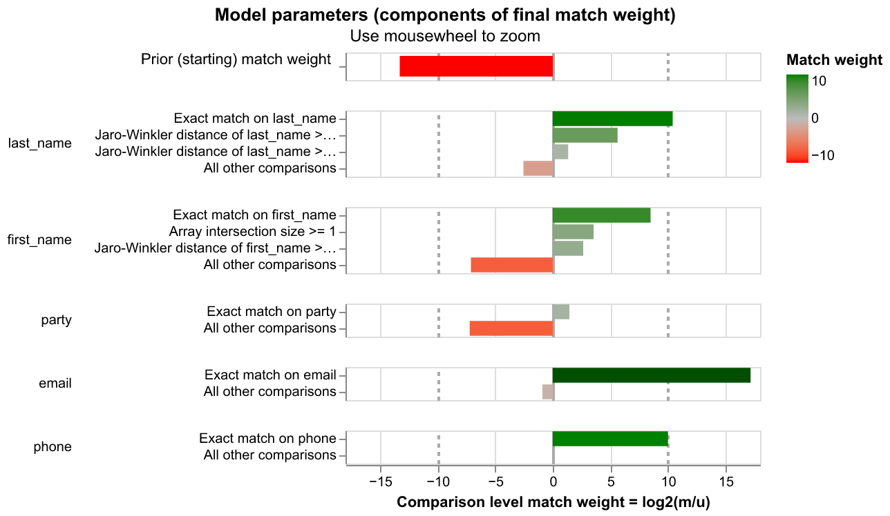
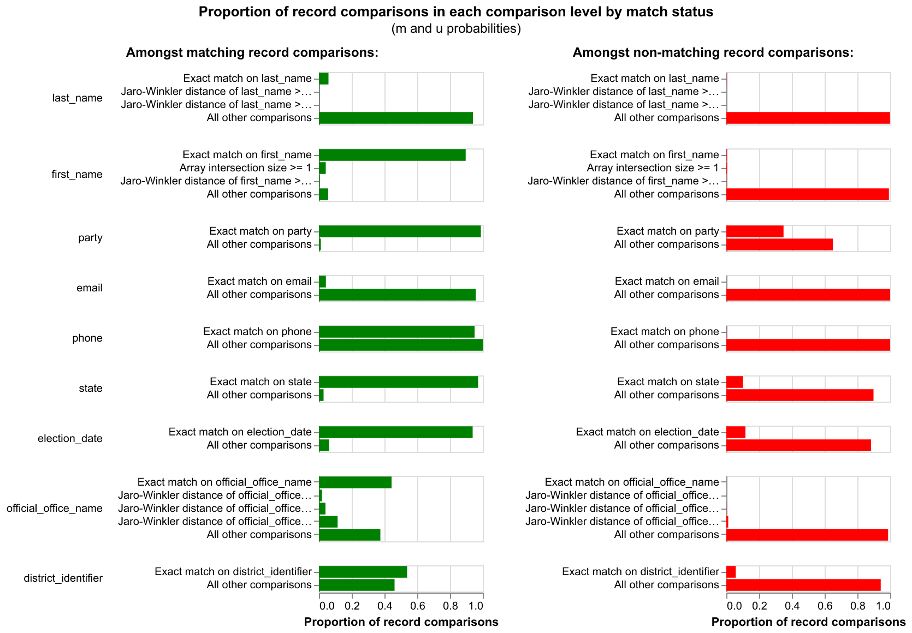

# Entity Resolution: BallotReady x TechSpeed Candidacies

Splink-based probabilistic record linkage to match candidacy records across
BallotReady (BR) and TechSpeed (TS). TechSpeed receives BallotReady race data,
enhances some records (adding phone/email), and also discovers "net new"
candidates BallotReady doesn't have yet. The overlap means we need entity
resolution to avoid duplicates before combining both sources in the civics mart.

## Quick start

```bash
cd entity_resolution
uv run python scripts/cli.py match --input data/input.csv
```

Or with a custom input file and output directory:

```bash
uv run python scripts/cli.py match --input /path/to/prematch.csv --output-dir /path/to/output/
```

**Input:** CSV file exported from `dbt_dball.int__er_prematch_candidacies`
**Output:**
- `results/pairwise_predictions.csv` — all scored candidate pairs
- `results/clustered_candidacies.csv` — all records with cluster assignments
- `results/match_weights_chart.html` — Splink match weight visualization
- `results/m_u_parameters_chart.html` — learned m/u probability visualization

## Design: candidate-level vs race-level attributes

The key architectural decision is the separation of attributes into two
categories:

**Candidate-level attributes** (used as Splink comparisons — contribute Bayes
factors to the match score):
- `last_name`, `first_name`, `party`, `email`, `phone`

**Race/election-level attributes** (used only in blocking rules — determine
which pairs are generated, but do NOT influence the match score):
- `state`, `official_office_name`, `election_date`, `district_identifier`,
  `city`, `election_stage`, `br_race_id_int`

### Why this separation matters

Multiple candidates run in the same race. When race-level attributes like
`official_office_name`, `election_date`, and `br_race_id` are included as
Splink comparisons, they produce massive positive Bayes factors for
*any* pair of candidates in the same race — overwhelming the name-mismatch
penalty. In testing, this caused **6,872 false positives** (63% of all
predictions) that required an extensive post-prediction filter to remove.

By moving race-level attributes to blocking rules only, the model scores
pairs purely on whether they look like the *same person*, while the blocking
rules ensure we only compare candidates who are plausibly in the *same race*.
This reduced post-prediction filtering from 6,872 pairs to just 5.

## How it works

The script uses [Splink 4](https://moj-analytical-services.github.io/splink/)
in `link_only` mode (cross-source matching, no within-source dedup) with
DuckDB as the backend.

### Preprocessing

- **Names:** lowercased and trimmed
- **First name nicknames:** the upstream dbt model (`int__er_prematch_candidacies`)
  maps each first name to an alias array via the `nicknames` seed (e.g.
  robert -> [robert, bob, bobby, rob, bert, ...]). The array always includes
  the original first name. Splink's `ArrayIntersectLevel` checks for overlap
  between alias arrays, so "robert" and "bob" are recognized as potential
  matches without requiring exact string similarity.
- **District identifiers:** leading zeros stripped ("01" -> "1") to normalize
  formatting differences between sources
- **`br_race_id_int`:** derived from `br_race_id` — keeps only integer values
  (BR-originated race IDs). Non-integer values like `ts_found_race_net_new`
  become null so the blocking rule only fires for records with a shared race ID.
- **Nulls:** literal `"null"` strings, empty strings, and `NaN` are all
  converted to `None` so Splink treats them as missing data

### Blocking rules (which pairs to compare)

Blocking rules determine which record pairs are generated for scoring. Splink
unions the pairs from each rule, deduplicating. All rules enforce race-level
constraints so that only candidates plausibly in the same race are compared.

| Order | Rule | Purpose |
|-------|------|---------|
| 1 | `br_race_id_int` (exact) | High-cardinality first pass. Pairs TS records with BR records in the same race. Covers the majority of matches. |
| 2 | `state + election_date + office_name (JW >= 0.88) + last_name` (exact) | Catches cross-source office formatting differences (e.g. "republic city council - ward 3" vs "republic city ward 3") for records without a shared race ID. |
| 3 | `state + last_name + election_date` (exact) | Broad catch-all for net-new TS records and cases not covered by race ID or office name. |
| 4 | `state + election_date + office_name (JW >= 0.88) + last_name (JW >= 0.88)` | Catches last name typos/variants across sources with different office formatting. |
| 5 | `phone` (exact) | Contact-info matches where names may differ. |
| 6 | `email` (exact) | Contact-info matches where names may differ. |

Rules 2 and 4 use DuckDB's `jaro_winkler_similarity` function via Splink's
`CustomRule` for fuzzy blocking.

### Comparisons (how pairs are scored)

Only candidate-level attributes contribute to the match score:

| Column | Type | Levels | Notes |
|--------|------|--------|-------|
| `last_name` | Jaro-Winkler | exact, >= 0.95, >= 0.88, else | Term frequency adjusted (down-weights common surnames) |
| `first_name` | Custom | exact -> nickname -> JW >= 0.92 -> else | Nickname match via alias array intersection; TF adjusted on exact |
| `party` | Exact | match, else | |
| `email` | Exact | match, else | |
| `phone` | Exact | match, else | |

### Training

Three EM passes with different blocking ensure all comparison columns get
trained. Each pass blocks on one comparison column (fixing it) and estimates
m probabilities for the rest:

1. Block on `last_name` -> trains first_name, party, email, phone
2. Block on `first_name` -> trains last_name, party, email, phone
3. Block on `email` -> trains last_name, first_name, party, phone

u probabilities are estimated via random sampling (5M pairs) before EM.

### Post-prediction person identity filter

A lightweight filter removes the small number of pairs (typically ~5) where
the `br_race_id_int` blocking rule generated a pair for two different
candidates in the same race who happen to score above the prediction
threshold. The filter requires:

1. **Last name must agree** (gamma > 0)
2. **First name must agree OR email/phone must match**

This is a minimal safety net — the model handles the vast majority of
discrimination on its own since only candidate-level attributes are in the
comparisons.

### Thresholds

- **Prediction threshold: 0.5** — captures all plausible matches for review
- **Clustering threshold: 0.95** — high confidence required to cluster, since
  the unit of matching is a *candidacy* (person + office + election date), not
  just a person

## Edge cases this handles

### Last name typos across sources

The fuzzy last name blocking rule (JW >= 0.88) ensures these pairs are
generated even when names don't match exactly:

| BR record | TS record | Match prob |
|-----------|-----------|------------|
| phillip **whitaker** (fort smith school board - zone 1) | phillip **whiteaker** (fort smith public school district zone 1) | 0.92 |
| joe **montelone** (green park city mayor) | joe **monteleone** (green park city mayor) | 0.72 |
| bob **feidler** (st. croix county board - dist 9) | bob **fiedler** (chenequa village board) | 0.83 |
| amanda **fuerst** (wauwatosa city council - dist 10) | amanda **fuers** (wauwatosa city council - dist 10) | 0.84 |
| emily **bassham** (mountainburg school board - zone 2) | emily **basham** (mountainburg school district, zone 2) | 0.88 |

### Cross-source office name formatting

BallotReady and TechSpeed often format the same office differently. The fuzzy
office blocking rule (JW >= 0.88) handles this:

| BR format | TS format | JW score |
|-----------|-----------|----------|
| `fort smith school board - zone 1` | `fort smith public school district zone 1` | 0.89 |
| `mountainburg school board - zone 2` | `mountainburg school district, zone 2` | 0.91 |
| `republic city council - ward 3` | `republic city ward 3` | 0.91 |

### First name nicknames

The alias array intersection catches nickname matches that string similarity
would miss:

| BR name | TS name | Mechanism |
|---------|---------|-----------|
| robert smith | bob smith | alias arrays both contain "bob" and "robert" |
| william jones | bill jones | alias intersection |
| james wilson | jim wilson | alias intersection |

### Same person, different candidacy stages (correctly separated)

Primary and general election candidacies for the same person are *not* matched
because they represent different candidacy records. The blocking rules require
`election_date` to agree, which naturally separates these:

| BR record (primary) | TS record (general) | Matched? |
|---------------------|---------------------|----------|
| joel straub, marathon county board dist 15, 2026-02-17 | joel straub, marathon county board dist 15, 2026-04-07 | No (different dates) |
| genene hibbler, oak creek-franklin school board, 2026-04-07 | genene hibbler, oak creek-franklin school board, 2026-02-17 | No (different dates) |

### Same race, different candidates (correctly separated)

Two different candidates running in the same race share office, state, date,
and district — but the model correctly separates them because only
candidate-level attributes (name, email, phone) are used for scoring:

| Candidate A | Candidate B | Matched? |
|-------------|-------------|----------|
| joel straub, marathon county board dist 15 | timothy sondelski, marathon county board dist 25 | No (different names) |
| clark rinehart, raleigh city council | sana siddiqui, raleigh city council | No (different names) |

## Current results (35,882 input records)

| Metric | Value |
|--------|-------|
| Input records | 18,345 BR + 17,537 TS |
| Pairwise pairs above 0.5 | 4,166 |
| Removed by person identity filter | 5 |
| High-confidence pairs (>= 0.95) | 3,882 |
| Borderline pairs (0.5-0.95) | 279 |
| Cross-source matched clusters | 3,726 |
| Within-source duplicate clusters | 0 |

## Diagnostic charts

### Match weights

Shows how much each comparison column contributes to the overall match score.
Bars to the right indicate evidence *for* a match when columns agree; bars to
the left indicate evidence *against* when they disagree.



<sub>[Interactive version](results/match_weights_chart.html)</sub>

### M/U parameters

Shows the learned probability distributions for each comparison level. The **m
probability** is the chance two records agree on a column *given they are a true
match*; the **u probability** is the chance they agree *given they are not a
match*. Columns where m is high and u is low are the most discriminating.



<sub>[Interactive version](results/m_u_parameters_chart.html)</sub>

## Next steps

### Productionization
- Convert Splink logic into a **dbt Python model** on Databricks. Reference
  pattern: `int__techspeed_candidates_fuzzy_deduped.py`
- Output table (`int__er_match_candidacies`) should contain `er_cluster_id`,
  source IDs, `match_probability`, and all prematch columns
- Update `marts/civics/candidacy.sql` to union BR + TS candidacies, join ER
  clusters, and deduplicate (BR wins most fields, TS wins phone/email)
