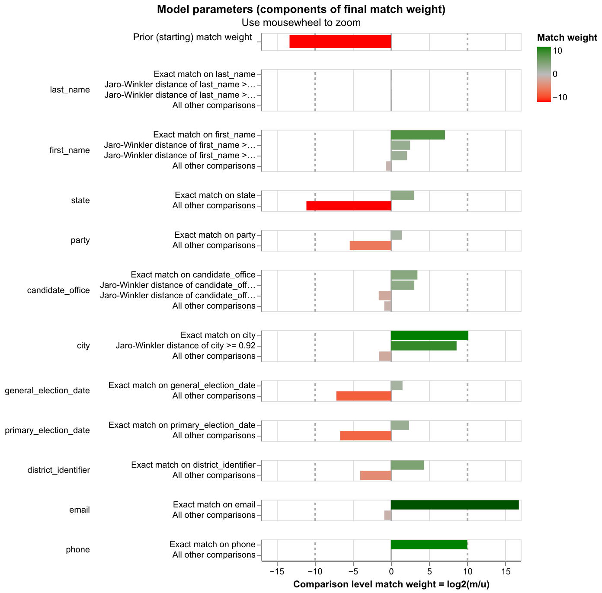
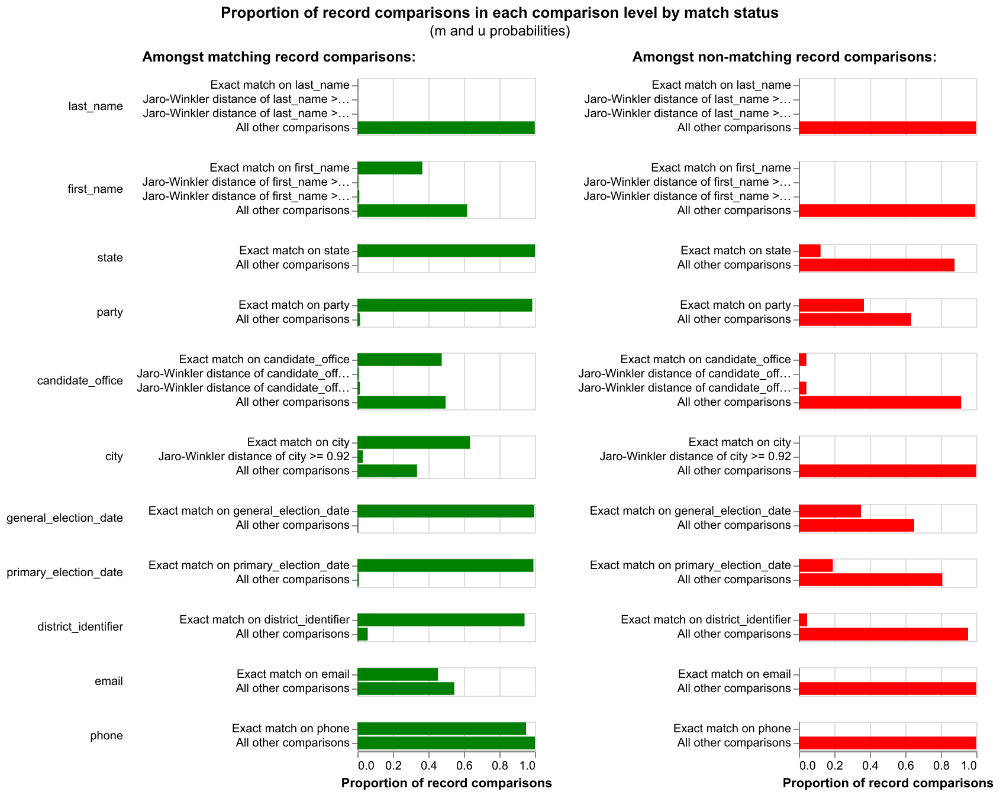

# Entity Resolution: BallotReady x TechSpeed Candidacies

Splink-based probabilistic record linkage to match candidacy records across
BallotReady (BR) and TechSpeed (TS). TechSpeed receives BallotReady race data,
enhances some records (adding phone/email), and also discovers "net new"
candidates BallotReady doesn't have yet. The overlap means we need entity
resolution to avoid duplicates before combining both sources in the civics mart.

## Quick start

```bash
cd prototyping/entity_resolution
uv run python scripts/01_initial_match.py
```

**Input:** `data/input.csv` — exported from `dbt_dball.int__er_prematch_candidacies`
**Output:**
- `results/pairwise_predictions.csv` — all scored candidate pairs
- `results/clustered_candidacies.csv` — all records with cluster assignments
- `results/match_weights_chart.html` — Splink match weight visualization
- `results/m_u_parameters_chart.html` — learned m/u probability visualization

## How it works

The script uses [Splink 4](https://moj-analytical-services.github.io/splink/) in
`link_only` mode (cross-source matching, no within-source dedup) with DuckDB as
the backend.

### Preprocessing

- **Names:** lowercased and trimmed (HumanName parsing was tested but removed —
  names arrive already parsed from dbt)
- **City normalization:** strips trailing "County"/"City" and normalizes
  "Saint"→"St." to handle naming convention differences between sources
  (e.g. "Kenosha County" vs "Kenosha", "Saint Louis" vs "St. Louis")
- **Nulls:** literal `"null"` strings, empty strings, and `NaN` are all
  converted to `None` so Splink treats them as missing data

### Blocking rules (which pairs to compare)

| Rule | Purpose |
|------|---------|
| `state + last_name` | Broad catch-all — necessary because office and city names differ systematically between sources |
| `state + first_name + candidate_office` | Catches last name variations (e.g. "de wane" vs "wane") |

**Why not block on `br_race_id`?** A `br_race_id` identifies a *race*, not a
candidate. Blocking on it compares all candidates in the same race, producing
massive false positives (different people running for the same office get scored
highly because state, city, office, and date all match perfectly).

### Comparisons

| Column | Type | Thresholds | Notes |
|--------|------|------------|-------|
| `last_name` | Jaro-Winkler | 0.95, 0.88 | |
| `first_name` | Jaro-Winkler | 0.92, 0.85 | |
| `state` | Exact | — | |
| `party` | Exact | — | |
| `candidate_office` | Jaro-Winkler | 0.88, 0.70 | Relaxed — naming conventions differ across sources |
| `city` | Jaro-Winkler | 0.92 | After preprocessing normalization |
| `general_election_date` | Exact | — | |
| `primary_election_date` | Exact | — | |
| `district_identifier` | Exact | — | |
| `email` | Exact | — | |
| `phone` | Exact | — | Never observed matching in training; uses defaults |

**Office threshold rationale:** The thresholds were relaxed from the default
(0.92, 0.80) to (0.88, 0.70) because sources use different naming conventions
for the same role. Examples: "Town Supervisor"↔"Township Supervisor" (JW=0.905),
"Constable"↔"County Constable" (JW=0.854), "College Board"↔"Community College
Board" (JW=0.823). Some offices are too different for Jaro-Winkler to help at
all: "Board Of Supervisor"↔"County Legislature" (JW=0.443).

### Training

Three EM passes with different blocking ensure all comparison columns get
trained:

1. Block on `state + general_election_date` → trains name, office, district, contact
2. Block on `state + last_name` → trains first name, dates, office, district
3. Block on `last_name + first_name` → trains state (not covered by passes 1-2)

### Thresholds

- **Prediction threshold: 0.2** — low, to capture all plausible matches for
  inspection in the pairwise output
- **Clustering threshold: 0.7** — balances precision and recall. Lowered from
  the initial 0.8 because same-person pairs with office/city mismatches
  (e.g. "Board of Supervisor"/"County Legislature") score ~0.77

## Diagnostic charts

### Match weights

Shows how much each comparison column contributes to the overall match score.
Bars to the right indicate the column is evidence *for* a match when it agrees;
bars to the left indicate evidence *against* a match when it disagrees. Longer
bars mean the column is more informative. For example, an exact `email` match is
strong evidence for a match, while a `last_name` mismatch is strong evidence
against.



<sub>[Interactive version](results/match_weights_chart.html)</sub>

### M/U parameters

Shows the learned probability distributions for each comparison level. The **m
probability** is the chance two records agree on a column *given they are a true
match*; the **u probability** is the chance they agree *given they are not a
match*. Columns where m is high and u is low are the most discriminating. This
chart helps identify columns where the model may have learned poorly (e.g.
`phone` was never observed matching in training).



<sub>[Interactive version](results/m_u_parameters_chart.html)</sub>

## Current results (35,760 input records)

| Metric | Value |
|--------|-------|
| Input records | 18,267 BR + 17,493 TS |
| Cross-source matches | 3,202 |
| High-confidence pairs (>0.95) | 3,779 |
| Recall on testable set | 86.7% (3,390 / 3,909) |
| Same-person misses | 193 (4.9%) |
| Different-person correct misses | 326 (8.3%) |

### Recall methodology

TechSpeed records carry a `br_race_id` linking them to BallotReady races. When
the BR counterpart for that race exists in the input, we can check whether
Splink clustered them together. Of 14,622 TS records with a known `br_race_id`:
- 10,713 (73%) reference races with no BR candidacy in the input (can't match)
- 3,909 (27%) have a BR counterpart — these are the testable set

### Remaining same-person misses (193)

The misses fall into two categories:

1. **First name nicknames + office mismatch (~120):** Both the first name and
   office name differ. The pair is blocked (same state + last name) but the
   combined score is too low. Examples: "bob"/"robert" + "Board Of
   Supervisor"/"County Legislature", "jim"/"james" + "Town Board"/"Township
   Council". Fixing either dimension would likely recover these.

2. **Below-threshold despite matching names (~60):** Pairs where names match but
   office + city differences push the score below 0.7. These could be recovered
   by lowering the clustering threshold, at the cost of more false positives.

## Analysis scripts

Additional scripts used during development for evaluating match quality:

| Script | Purpose |
|--------|---------|
| `check_recall.py` | Checks how many TS records with known `br_race_id` matched their BR counterpart |
| `analyze_misses.py` | Categorizes same-person misses by reason (below threshold, not blocked, different person) |

## Next steps

### Short-term improvements
- **First name nickname normalization** — map common nicknames (bob→robert,
  jim→james, etc.) in preprocessing. This would unblock ~50+ same-person misses
  where the only barrier is first name + office mismatch.
- **Office name standardization** — map TS office names to BR conventions
  upstream in dbt (e.g. "Board Of Supervisor"→"County Legislature"). This is the
  single biggest source of score depression.
- **Increase BR coverage in prematch** — 73% of testable TS records reference
  BR races with no BR candidacy in the input. Investigate filters in
  `int__er_prematch_candidacies.sql`.

- **Investigate BR `general_election_date` column** — some BallotReady records
  have what appear to be primary election dates populated in the
  `general_election_date` column. This may cause date-based comparisons to fail
  for records that should match (TS has the date in `primary_election_date`, BR
  has it in `general_election_date`).

### Productionization
- Convert Splink logic into a **dbt Python model** on Databricks. Reference
  pattern: `int__techspeed_candidates_fuzzy_deduped.py`
- Output table (`int__er_match_candidacies`) should contain `er_cluster_id`,
  source IDs, `match_probability`, and all prematch columns
- Update `marts/civics/candidacy.sql` to union BR + TS candidacies, join ER
  clusters, and deduplicate (BR wins most fields, TS wins phone/email)
